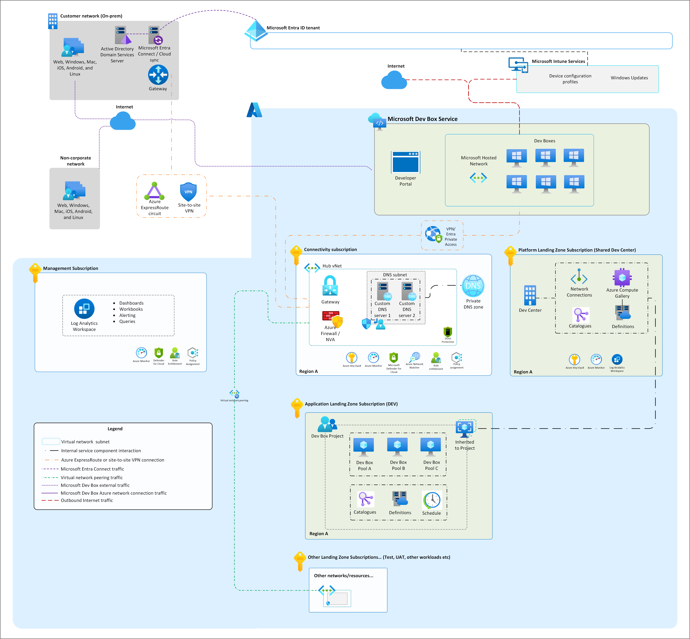
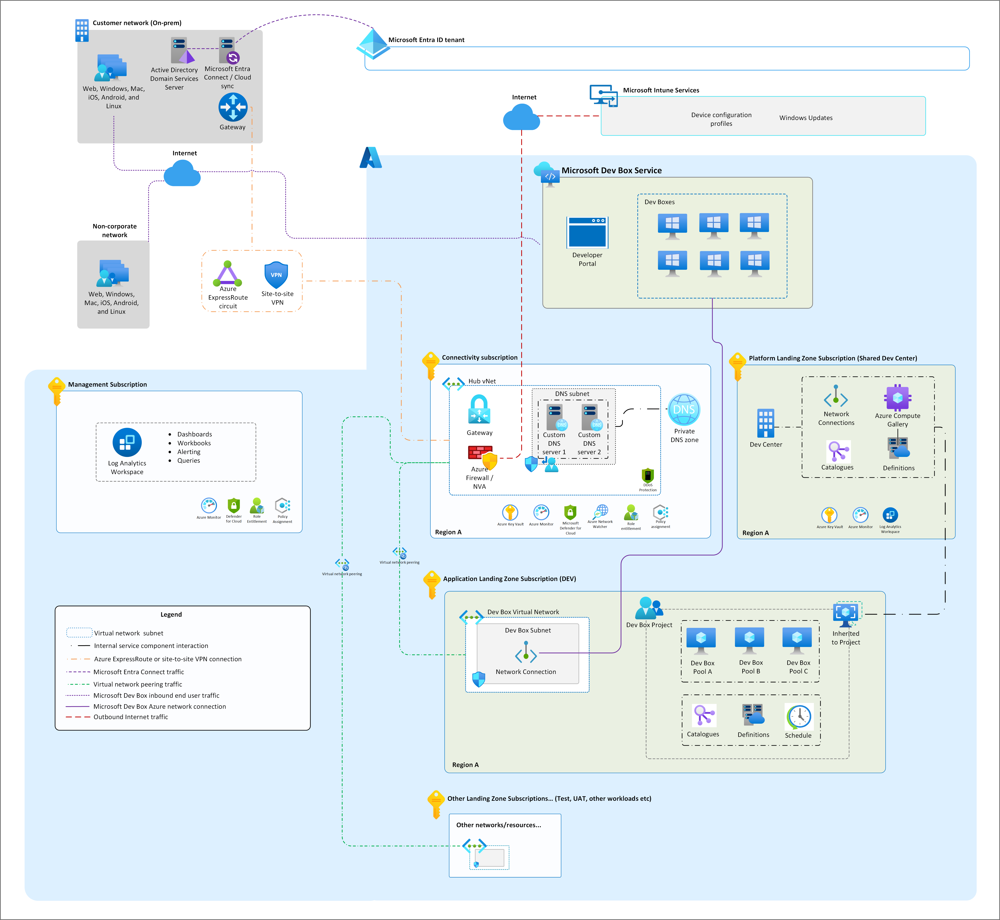

# Dev Box Networking Approaches

Organizations can deploy Dev Boxes using one or both of the following networking approaches, depending on the needs of their developer personas:

## Microsoft-hosted network (MIH)
An internet-first, fully isolated environment well-suited for SaaS-heavy or Zero Trust–aligned development scenarios.  
While MIH Dev Boxes have no direct connection to a corporate network, they can still securely access private or on-premises resources through **Zero Trust Network Access (ZTNA)** solutions such as [Microsoft Entra Private Access](https://www.microsoft.com/en-gb/security/business/identity-access/microsoft-entra-private-accesss), or via a VPN client.  
These methods ensure resource access is granted based on **identity and device compliance** rather than implicit network location.

## Azure Network Connections (Azure VNet)
The second approach connects Dev Boxes directly to an Azure virtual network for seamless access to private Azure resources, internal services, or hybrid/on-premises networks via Azure VNet peering and/or VPN gateways.  
This approach is often used for developer personas that rely on legacy protocols, private endpoints, or centralized egress controls.

---

In many organizations, different developer personas require different access patterns — for example:
- Some work entirely with internet-based services.
- Others need frequent access to internal APIs, databases, or build infrastructure on a private network.

As a result, **both approaches can coexist** to meet diverse requirements.

---

Please ensure you consult the following [documentation](https://learn.microsoft.com/en-us/azure/dev-box/concept-dev-box-network-requirements) for Microsoft Dev Box networking requirements.